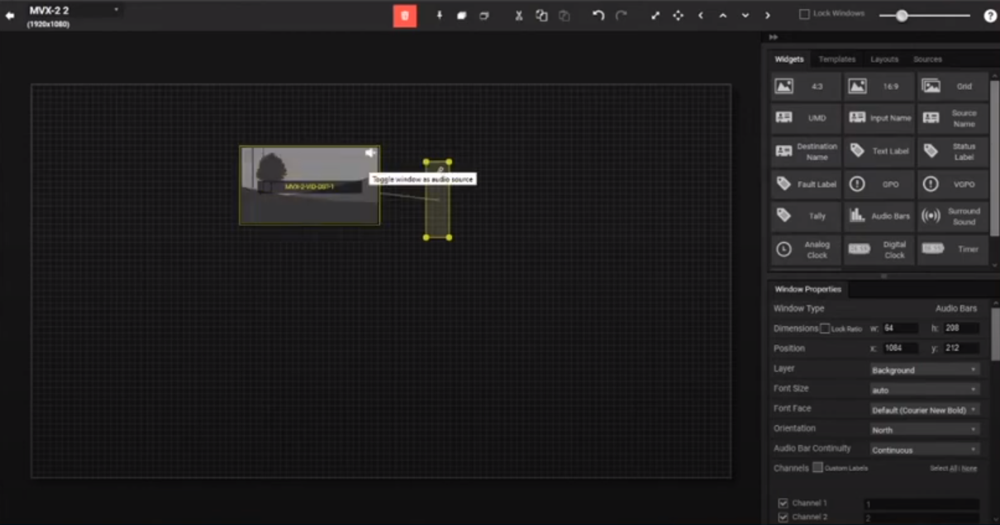

O desafio consiste em desenvolver uma aplicação React (só front-end) com a seguinte funcionalidade:

A aplicação apresenta uma área central (um rectangulo de tamanho fixo, tal como na imagem abaixo) ao qual podem ser adicionados elementos a partir de uma palete. Esses elementos são: texto definido pelo utilizador, dois ou mais tipos de rectângulos. Os rectângulos devem conter HTML arbitrário, definido pela aplicação. Este HTML deve incluir, pelo menos uma imagem e texto.

Os elementos podem ser apagados, movidos livremente, redimensionados ou rodados.  
Deve ser possível ativar e desativar uma grelha de tamanho variável para ajudar a alinhar elementos (snap to grid). 

A aplicação terá um mecanismo que permita que o utilizador grave o documento atual para um ficheiro JSON, bem como que o utilizador carregue um documento previamente gravado.

Based on the challenge description, you need to build a React application with the following features:

1. A central area where elements can be added from a palette. These elements include user-defined text and two or more types of rectangles. The rectangles should contain arbitrary HTML defined by the application, including at least one image and text.

2. The elements should be deletable, freely movable, resizable, and rotatable.

3. The application should have a mechanism to save the current document to a JSON file and load a previously saved document.

4. It should be possible to enable and disable a variable size grid to help align elements (snap to grid).

To implement these features, you might need to use various libraries and techniques. Here are some suggestions:

1. For the drag-and-drop, resizing, and rotation functionality, you can use libraries like [`react-dnd`](command:_github.copilot.openSymbolInFile?%5B%22package.json%22%2C%22react-dnd%22%5D "package.json") or [`react-beautiful-dnd`](command:_github.copilot.openSymbolInFile?%5B%22package.json%22%2C%22react-beautiful-dnd%22%5D "package.json").

2. To enable the snap-to-grid feature, you might need to implement a custom solution. This could involve calculating the position of each element relative to the grid and adjusting its position accordingly.

3. For saving and loading the document, you can use the built-in `JSON.stringify` and `JSON.parse` methods in JavaScript. You might need to implement a function that converts your application state to a serializable format and another function that restores the state from this format.

4. For the user interface, you can continue using Tailwind CSS as you have been doing in your [`App.tsx`](command:_github.copilot.openSymbolInFile?%5B%22src%2FApp.tsx%22%2C%22App.tsx%22%5D "src/App.tsx") file.

Remember to break down the problem and tackle each feature one at a time. Start by setting up the basic structure of your application and then gradually add the required features.
